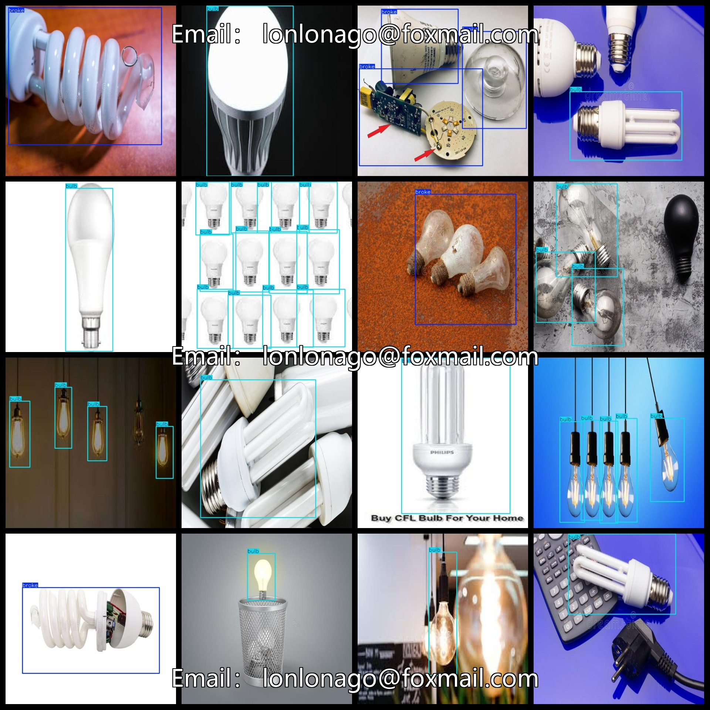

# Bad bulb Detection Dataset 499 imagesVOC+YOLO format

Bad bulb detection dataset 499 VOC + YOLO format

Dataset format: Pascal VOC format + YOLO format (the txt file does not contain the split path, it only contains jpg images and corresponding VOC format xml files and yolo format txt files)

Number of images (number of jpg files): 499

Number of annotations (number of xml files): 499

Number of annotations (number of txt files): 499

Label count: 2

The Github repository is: datasets_sl

Annotation class names: ["broke","bulb"]

Number of boxes labeled in each category:

broke frame count = 157

bulb frame count = 761

Total boxes: 918

Number of images per category:

broke annotated images = 96

bulb annotated images = 410

Image resolution: 640x640

Use the labeling tool: labelImg

Dataset augmented: Yes

Rules for annotation: Draw a rectangle around the category.

Important note: The dataset does not have been divided into training, validation, and testing sets.

Special Disclaimer: This dataset does not guarantee the accuracy of the trained models or weight files.

Annotation and image details are as follows:

## Images

---

Here is a pay link on Stripe (https://buy.stripe.com/3cs8yP7sY87d0vu9AB). Please contact me lonlonago@foxmail.com after funding $89, and I will send you a complete data files, thank you!

